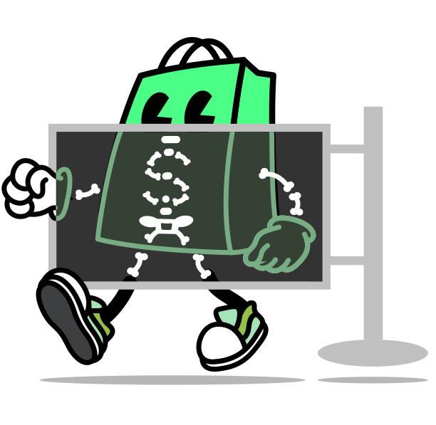

<h1 align="center" style="position: relative;">
  <br>
    
  <br>
  Fancy Peoples Shopify Theme
</h1>

A luxury Shopify theme designed for premium fashion and lifestyle brands. Features modern animations, responsive design, and comprehensive customization options.

<p align="center">
  <a href="./LICENSE.md"></a>
  <a href="./actions/workflows/ci.yml"></a>
</p>

## Getting started

### Prerequisites

Before starting, ensure you have the latest Shopify CLI installed:

- [Shopify CLI](https://shopify.dev/docs/api/shopify-cli) – helps you download, upload, preview themes, and streamline your workflows

If you use VS Code:

- [Shopify Liquid VS Code Extension](https://shopify.dev/docs/storefronts/themes/tools/shopify-liquid-vscode) – provides syntax highlighting, linting, inline documentation, and auto-completion specifically designed for Liquid templates

### Clone

Clone this repository using Git or Shopify CLI:

```bash
git clone git@github.com:Quinn-Kiwalabye/fancy-peoples-shopify-theme.git
```

## 🌟 Custom Sections

### Hero Slideshow
- **Image & Video Support** - Upload images or embed YouTube/Vimeo videos
- **Auto-play & Navigation** - Touch/swipe controls with pagination dots
- **Fully Customizable** - Text positioning, colors, overlays, and timing

### Featured Collections  
- **4-Column Layout** - Responsive product category showcase
- **Hover Effects** - Modern animations and transitions
- **Easy Management** - Link to collections with custom images

### About Us
- **Dual Images** - Overlapping positioned images with rotations
- **Content Blocks** - Multiple text blocks with flexible positioning
- **Scroll Animations** - Smooth scale-in effects on scroll

### Preview

Preview this theme using Shopify CLI:

```bash
shopify theme dev --store=your-store.myshopify.com
```

## Theme architecture

```bash
.
├── assets          # Stores static assets (CSS, JS, images, fonts, etc.)
├── blocks          # Reusable, nestable, customizable UI components
├── config          # Global theme settings and customization options
├── layout          # Top-level wrappers for pages (layout templates)
├── locales         # Translation files for theme internationalization
├── sections        # Modular full-width page components
├── snippets        # Reusable Liquid code or HTML fragments
└── templates       # Templates combining sections to define page structures
```

To learn more, refer to the [theme architecture documentation](https://shopify.dev/docs/storefronts/themes/architecture).

### Templates

[Templates](https://shopify.dev/docs/storefronts/themes/architecture/templates#template-types) control what's rendered on each type of page in a theme.

The Skeleton Theme scaffolds [JSON templates](https://shopify.dev/docs/storefronts/themes/architecture/templates/json-templates) to make it easy for merchants to customize their store.

None of the template types are required, and not all of them are included in the Skeleton Theme. Refer to the [template types reference](https://shopify.dev/docs/storefronts/themes/architecture/templates#template-types) for a full list.

### Sections

[Sections](https://shopify.dev/docs/storefronts/themes/architecture/sections) are Liquid files that allow you to create reusable modules of content that can be customized by merchants. They can also include blocks which allow merchants to add, remove, and reorder content within a section.

Sections are made customizable by including a `` in the body. For more information, refer to the [section schema documentation](https://shopify.dev/docs/storefronts/themes/architecture/sections/section-schema).

### Blocks

[Blocks](https://shopify.dev/docs/storefronts/themes/architecture/blocks) let developers create flexible layouts by breaking down sections into smaller, reusable pieces of Liquid. Each block has its own set of settings, and can be added, removed, and reordered within a section.

Blocks are made customizable by including a `` in the body. For more information, refer to the [block schema documentation](https://shopify.dev/docs/storefronts/themes/architecture/blocks/theme-blocks/schema).

## Schemas

When developing components defined by schema settings, we recommend these guidelines to simplify your code:

- **Single property settings**: For settings that correspond to a single CSS property, use CSS variables:

  ```liquid
  <div class="collection" style="--gap: {{ block.settings.gap }}px">
    ...
  </div>

  
    .collection {
      gap: var(--gap);
    }
  

  
  {
    "settings": [{
      "type": "range",
      "label": "gap",
      "id": "gap",
      "min": 0,
      "max": 100,
      "unit": "px",
      "default": 0,
    }]
  }
  
  ```

- **Multiple property settings**: For settings that control multiple CSS properties, use CSS classes:

  ```liquid
  <div class="collection {{ block.settings.layout }}">
    ...
  </div>

  
    .collection--full-width {
      /* multiple styles */
    }
    .collection--narrow {
      /* multiple styles */
    }
  

  
  {
    "settings": [{
      "type": "select",
      "id": "layout",
      "label": "layout",
      "values": [
        { "value": "collection--full-width", "label": "t:options.full" },
        { "value": "collection--narrow", "label": "t:options.narrow" }
      ]
    }]
  }
  
  ```

## CSS & JavaScript

For CSS and JavaScript, we recommend using the [``](https://shopify.dev/docs/api/liquid/tags#stylesheet) and [``](https://shopify.dev/docs/api/liquid/tags/javascript) tags. They can be included multiple times, but the code will only appear once.

### `critical.css`

The Skeleton Theme explicitly separates essential CSS necessary for every page into a dedicated `critical.css` file.

## Contributing

We're excited for your contributions to the Skeleton Theme! This repository aims to remain as lean, lightweight, and fundamental as possible, and we kindly ask your contributions to align with this intention.

Visit our [CONTRIBUTING.md](./CONTRIBUTING.md) for a detailed overview of our process, guidelines, and recommendations.

## License

Skeleton Theme is open-sourced under the [MIT](./LICENSE.md) License.
